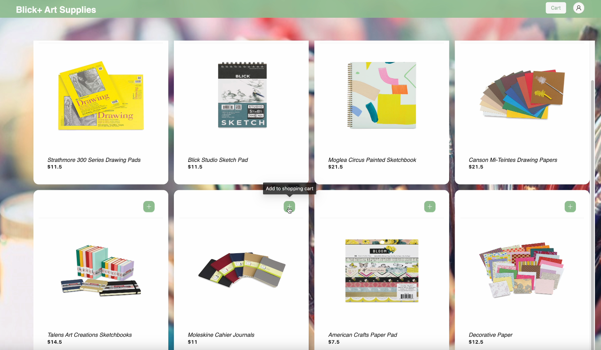

## Blick+: A Full Stack Art Supplies Shopping Web Application
+ **Technologies: Java, JavaScript, Spring, React, Hibernate, MySQL, AWS EC2**
+ Developed an user-friendly web page with React and Ant Design
+ Implemented RESTful APIs via Spring Framework including registration, login, logout, supplies searching, ordering and checkout
+ Improved security by using session-based authentication and server-side authorization via Spring Security
+ Utilized Hibernate to access and operate data stored in MySQL Database on Amazon RDS
+ Deployed client and web server to docker container on AWS EC2 for better stability
+ Demo on Youtube: https://youtu.be/k7mixDfzbNQ
   

